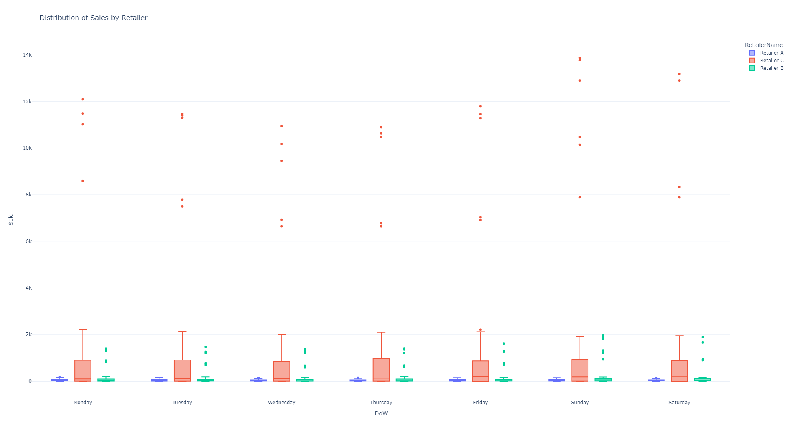

# Exploring Groceries Data

Data comes from https://github.com/shelfengine/interview.

## Setup

```
# Create virtual environment
python -m venv .venv

# Windows
# .venv\Scripts\activate.bat

# Unix or MacOS
# source .venv/bin/activate

# Install dependencies
python -m pip install -r requirements.txt
```

## Project Organization

    ├── README.md
    ├── data
    │   ├── interim        <- Intermediate data that has been transformed.
    │   ├── processed      <- The final, canonical data sets for modeling.
    │   └── raw            <- The original, immutable data dump.
    │
    ├── models             <- Trained and serialized models, model predictions, or model summaries
    │
    ├── notebooks          <- Jupyter notebooks. Naming convention is a number (for ordering),
    │                         the creator's initials, and a short `-` delimited description, e.g.
    │                         `1.0-jqp-initial-data-exploration`.
    │
    │
    ├── reports            <- Generated analysis as HTML, PDF, LaTeX, etc.
    │   └── figures        <- Generated graphics and figures to be used in reporting
    │
    ├── requirements.txt   <- The requirements file for reproducing the analysis environment, e.g.
    │                         generated with `pip freeze > requirements.txt`
    │
    ├── setup.py           <- makes project pip installable (pip install -e .) so src can be imported
    └── src                <- Source code for use in this project.
        ├── __init__.py    <- Makes src a Python module
        │
        ├── data           <- Scripts to process data
        │   └── make_dataset.py
        │
        ├── features       <- Scripts to turn raw data into features for modeling
        │   └── build_features.py
        │
        ├── models         <- Scripts to train models and then use trained models to make
        │   │                 predictions
        │   ├── predict_model.py
        │   └── train_model.py
        │
        └── visualization  <- Scripts to create exploratory and results oriented visualizations
            └── visualize.py


--------

## Running the Code

### Data Preparation

To create interim data sources, run

```python
python src/data/make_dataset.py [optional sales filepath] [optional lookup filepath]
```

By adding `@click.argument` decorators from the `click` module, we can pass arguments to `src.data.make_dataset.main` via the command line. On Windows, I can run

```markdown
(.venv) PS C:\Users\rtjoh\Documents\Projects\groceries-dataset> python src/data/make_dataset.py .\data\raw\8570071016.csv .\data\raw\3390929248.csv
2021-10-16 22:44:37,077 - __main__ - DEBUG - fetching category lookup
2021-10-16 22:44:37,079 - __main__ - DEBUG - ingesting sales history
2021-10-16 22:44:37,083 - __main__ - DEBUG - merging sales and lookup
2021-10-16 22:44:37,085 - __main__ - DEBUG - computing and writing transactions data
2021-10-16 22:44:37,211 - __main__ - DEBUG - writing cleaned data frame
```

The first argument is the file path to the sales data, and the second argument is the file path to the lookup data. In practice, I imagine that these data sources are stored in a database as opposed to `.csv` files so the arguments could be modified to specify a date range parameter. Running this command creates `data/interim/clean_data.csv` which is the processed sales data joined with lookup values.

```
>>> merged_df
    DeliveryDate  WeekNumber  CategoryId                            RetailerId  Sold     CategoryName RetailerName
0     2021-03-01           9           0  BEE9891F-628C-467C-8292-008B938BBC34   0.0             Bowl   Retailer A
1     2021-03-02           9           0  BEE9891F-628C-467C-8292-008B938BBC34   0.0             Bowl   Retailer A
2     2021-03-03           9           0  BEE9891F-628C-467C-8292-008B938BBC34   2.0             Bowl   Retailer A
3     2021-03-04           9           0  BEE9891F-628C-467C-8292-008B938BBC34   0.0             Bowl   Retailer A
4     2021-03-05           9           0  BEE9891F-628C-467C-8292-008B938BBC34   4.0             Bowl   Retailer A
..           ...         ...         ...                                   ...   ...              ...          ...
803   2021-03-17          11          23  46D64632-2C73-4DBF-A3B3-EDFF547300F0   0.0  Vegetable Trays   Retailer C
804   2021-03-18          11          23  46D64632-2C73-4DBF-A3B3-EDFF547300F0   1.0  Vegetable Trays   Retailer C
805   2021-03-19          11          23  46D64632-2C73-4DBF-A3B3-EDFF547300F0   0.0  Vegetable Trays   Retailer C
806   2021-03-20          11          23  46D64632-2C73-4DBF-A3B3-EDFF547300F0   1.0  Vegetable Trays   Retailer C
807   2021-03-21          11          23  46D64632-2C73-4DBF-A3B3-EDFF547300F0   1.0  Vegetable Trays   Retailer C
```

### Visualization

To create interim data sources, run

```python
python src/visualization/explore.py [--interactive]
```

Just like earlier, the `click` modules allows us to add a command line argument. The `--interactive` flag will open interactive plots in the browser. From the logger, we see that this creates 3 `.png` files.

```markdown
(.venv) PS C:\Users\rtjoh\Documents\Projects\groceries-dataset> & c:/Users/rtjoh/Documents/Projects/groceries-dataset/.venv/Scripts/python.exe c:/Users/rtjoh/Documents/Projects/groceries-dataset/src/visualization/explore.py      
2021-10-17 10:52:55,055 - __main__ - INFO - generating `data/processed/sales_by_retailer.png`
2021-10-17 10:52:57,334 - __main__ - INFO - generating `data/processed/sales_through_time.png`
2021-10-17 10:52:57,673 - __main__ - INFO - generating `data/processed/normalized_sales_through_time.png`
```

#### Sales by Retailer

First, we can see a simple distribution of total sales by Day of the Week. This plot isn't incredibly informative, but it does tell us that Retailer C far outsells Retailers A and B. Also, excluding outliers, there isn't a very strong weekly shape to the sales data (across all categories, there may be a shape to individual categories as the next plot suggests).



#### Sales Through Time

The next plot shows sales through time for each category by retailer. We can see that Fruits and Vegetables are biggest sellers for Retailer B and Retailer C with all other categories only comprising a small proportion of total sales. 


It is import to note that these sales are in total number of items as opposed to `Sales * Price`. It could be the case that for Retailer B, Meal Kits (green) are a larger proportion of their revenue than Vegetable trays (orange) so they are more interested in the Meal Kit forecast despite selling less total Meal Kits than Vegetable trays.


#### Normalized Sales Through Time

It might be helpful to view sales through time normalized by category. Below we see sales through time with min-max normalization by Category. It is important to note that these values were also grouped by retailer before min and max statistics were computed. This was done because we are chosing to ignore any inter-retailer effects and are considering each retailer to operate completely indepedently. This assumption likely doesn't apply to larger datasets and certainly not when the retailers are close geographically. In those cases, we would consider the effect of one retailer being the primary source of a given category (e.g. Retailer A sells 90% of the regions salads).


Regardless, the time series are so messy that there is little to say here other than we can clearly see the "last-observed carried forward" imputation that was done earlier. This view also explains why the missing values all occured on March 21st (which is the final day of the dataset).

### Modeling

To run the modeling steps, call

```python
python src/visualization/explore.py [--interactive] [--clusters n]
```

Just like earlier, this script has an `--interactive` flag that will open interactive plots in the browser. This script also has a `--cluster` argument which specifies the number of unsupervised clusters to generate with a default value of 3.

```markdown
(.venv) PS C:\Users\rtjoh\Documents\Projects\groceries-dataset> & c:/Users/rtjoh/Documents/Projects/groceries-dataset/.venv/Scripts/python.exe c:/Users/rtjoh/Documents/Projects/groceries-dataset/src/models/model.py --clusters 3 --interactive
2021-10-17 14:36:32,537 - __main__ - INFO - loading cleaned data
2021-10-17 14:36:32,557 - __main__ - INFO - creating category series by date and retailer
2021-10-17 14:36:32,561 - __main__ - INFO - BEGIN running unsupervised clustering with 3 clusters
2021-10-17 14:36:41,519 - __main__ - INFO - DONE running unsupervised clustering
2021-10-17 14:36:41,519 - __main__ - INFO - applying clustering labels to dataset
2021-10-17 14:36:41,523 - __main__ - INFO - creating cluster label dictionary
2021-10-17 14:36:41,525 - __main__ - INFO - generating `data/processed/labeled_cluster_distributions.png`
```

#### Clustering

With the huge number of retail categories, is there a way to group together categories with similar behaviors? Using the trendpy package (https://trendypy.readthedocs.io/en/latest/index.html), we can run some simple unsupervised clustering on the data. To correct for certain categories dominating the total number of sales, we've normalized all categories to the range [0, 1]. Note that this analysis ignores specific retailers so we're instead looking at the global trends of category sales.

Using only two clusters, we can see some stark differences in distributions, as the following graphic illustrates. Here we've plotted the distributions of each cluster, grouped by day of the week.

.

Cluster 1 (blue) has a very strong weekly shape (with most sales occurring on Sunday and Saturday) while Cluster 0 (red) is distributed roughly equally throughout the week. For reference, Cluster 1 contains the following categories:

* Fruit
* Fruit Tray
* Meal Kit
* Platter
* Vegetable Tray 
* Dips
* Parfait
* Sandwiches
* Vegetable Trays

Cluster 0 contains the following categories:

* Bowl
* Packaged Meals
* Pinwheel
* Quiche
* Salad
* Sandwich
* Snack
* Wet Salad
* Wrap
* Dip
* Vegetables
* Cut Fruit
* Cut Vegetables
* Individual Snack Tray
* Snacks

Listing the constituent categories, there is no clear difference between the clusters. Even `Dip` and `Dips` don't belong to the same cluster, something a pure natural language processing approach would fail to catch.

If we increase the number of clusters to 3, we can see further differentiation.


There is still a cluster with strong weekly shaping (Cluster 2), and a cluster without any strong shaping at all (Cluster 0). The new cluster (Cluster 0) seems contain items with near 0 (or category minimum) sales throughout the work week with a sharp change in distribution on the weekend. On those days (Monday through Friday), the median sales are near 0 (which would be the minimum value of the category). This might indicate that categories in this cluster experience low demand roughly 50% of the time, occaisionally experiencing large spikes. It would be really interesting to see how these clusters change with a larger dataset.

## Future Work

* Run additional diagnostics on Sales data 

Without any customer segmentation, it is difficult to tie together different categories into a single transaction. This could be done without any personally-identifiable information and would greatly help any clustering or exploratory analysis.

* Integrate data processing pipeline with database

At the moment, the sales data is ingested via `.csv` files. In the future, I would like to integrate the pre-processing pipeline with a data lake. I'm interested in learning more about the update schedule of customer data, e.g. how frequently are our transaction databases being updated? Depending on the answer, how quickly can we adapt to surges in demand (as might be the case in for categories in Cluster 1 above)?

* Develop simple time series models

Limited by the static dataset (of only 3 weeks in March), I'm hesitant to move forward with any initial time series model. Not only is there not enough data to train and validate models, can we be sure that these models will generalize well? It may be the case that the demand of certain categories is "time-of-year-invariant" so that a model training on only data from March would perform fine in November, but I doubt this is the case. Even if we can make that assumption, there would be supply-chain issues for seasonal items like Fruit and Vegetables. These concerns may not necessarily matter for a "demand" model but would certainly affect the practicality of any demand forecasting.

